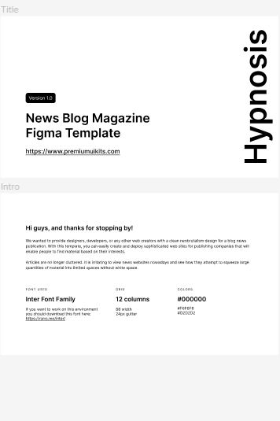

# Hypnosis

> Set up the project, the goal here is to master all of the tools and best practices about Linter and Gitflow.

Additional description about the project and its features.

##  Built With

- HTML
## Status project

- In Develop
## Authors
 -GitHub:https://github.com/Albinpirela @Albinpirela
 -likedin:https://www.linkedin.com/feed/ albin pirela
##  🤝 Contributing
 -Contributions, issues, and feature requests are welcome!
 Feel free to check the [issues page](../../issues/).
## Show your support

Give a ⭐️ if you like this project!
## Acknowledgments
- Our Studying group!
## 📝 License

This project is [MIT](./MIT.md) licensed.
